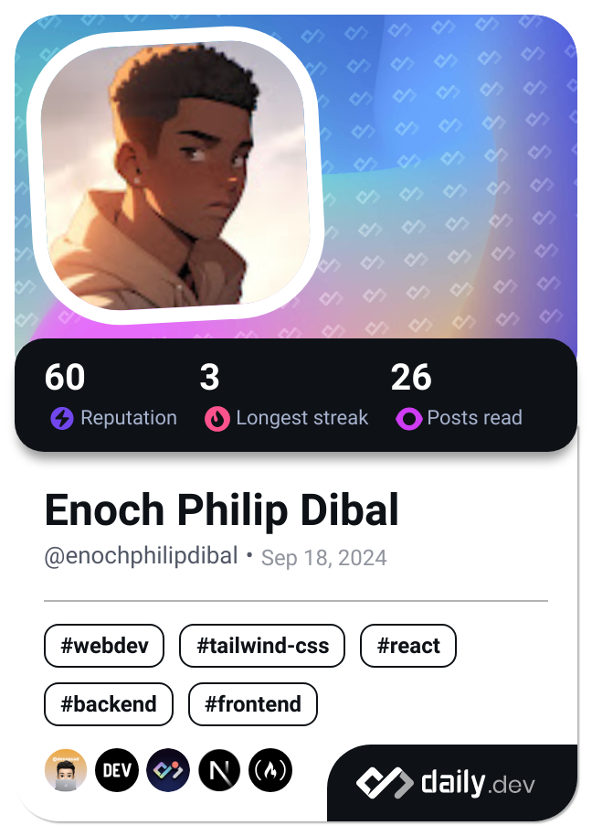

<!DOCTYPE html>
<html lang="en">
<head>
    <meta charset="UTF-8">
    <meta name="viewport" content="width=device-width, initial-scale=1.0">
    <title>Enoch Philip Dibal - Software Developer</title>
    
</head>
<body>
    

        

            <h1>Enoch Philip Dibal</h1>
            
            
Software Developer | Building Scalable and Efficient Solutions

        

        

            
            
        

        

            <h2>About Me</h2>
            
Hi, I'm Enoch Philip Dibal, a passionate software developer with a strong background in building scalable and efficient software solutions. I'm proficient in a range of programming languages, including JavaScript, TypeScript, HTML, and CSS, and have a strong understanding of front-end and back-end development, with expertise in Express, Next.js, React, and MongoDB.

        

        

            <h2>Achievements</h2>
            <ul>
                <li>Developed multiple scalable and efficient web applications using Next.js and Express, resulting in improved user experience and increased productivity.</li>
                <li>Successfully implemented responsive and interactive UI components using React, Tailwind, and CSS, enhancing overall user engagement.</li>
                <li>Designed and implemented a robust database schema using MongoDB, ensuring data consistency and integrity.</li>
            </ul>
            
  

        

        

            <h2>Projects</h2>
            <ul>
                <li><a href="https://your-portfolio-website.com">Portfolio Website</a> - A showcase of my projects and achievements, built using Next.js, React, and Tailwind.</li>
                <li><a href="https://github.com/your-github-username/project-1">Other Project 1</a> - A brief description of your project.</li>
                <li><a href="https://github.com/your-github-username/project-2">Other Project 2</a> - A brief description of your project.</li>
            </ul>
        

        

            <h2>Skills</h2>
            <ul>
                <li>Programming languages: JavaScript, TypeScript, HTML, CSS</li>
                <li>Front-end frameworks: React, Next.js</li>
                <li>Back-end frameworks: Express</li>
                <li>Databases: MongoDB</li>
                <li>Styling: Tailwind, CSS</li>
                <li>Other skills: Responsive design, Interactive UI components, Scalable architecture</li>
            </ul>
        

        

            <h2>Get in Touch</h2>
            
Feel free to reach out to me on <a href="mailto:arhyelphilip024@gmail.com">arhyelphilip024@gmail.com</a> or <a href="https://www.linkedin.com/in/aehyel24/">LinkedIn</a>.

        

        

            <h2>Let's Connect</h2>
            
<a href="https://github.com/arhyel24">GitHub</a> | <a href="https://x.com/arhyel24">Twitter</a> | <a href="https://www.linkedin.com/in/arhyel24/">LinkedIn</a>

            
        

    

</body>
</html>
